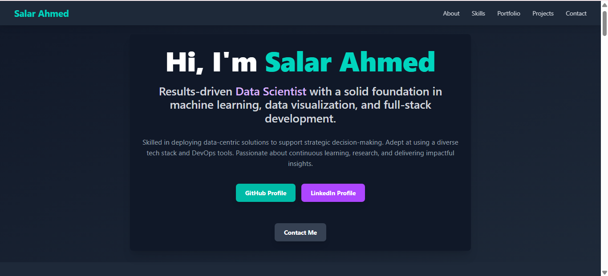

# Salar Ahmed's Data Science & Full-Stack Portfolio

[](https://vercel.com/salarsalarsalar/my-portfolio)


*(This is a screenshot of your deployed portfolio!)*

A dynamic and modern portfolio website showcasing my expertise in Data Science, Machine Learning, Data Visualization, and Full-Stack Development. This interactive platform features dynamically loaded GitHub projects, an expandable portfolio image gallery, and engaging scroll-reveal animations.

## Live Demo

Explore the live version of my portfolio deployed on Vercel:
👉 [https://my-portfolio-m4elqliu4-salar-ahmeds-projects.vercel.app/](https://my-portfolio-m4elqliu4-salar-ahmeds-projects.vercel.app/)

## Features

* **Professional Summary:** An overview of my skills and professional background.
* **Education & Experience:** Details of my academic background and work experience.
* **Comprehensive Skills Section:** Categorized list of programming languages, data visualization tools, machine learning frameworks, DevOps tools, web development technologies, databases, and blockchain tools.
* **Dynamic GitHub Projects:** Fetches and displays public repositories directly from my GitHub profile (`salarsalarsalar`), providing up-to-date project showcases. Includes fallback projects if fetching fails.
* **Interactive Portfolio Gallery:** Displays 36 portfolio images with unique descriptions. Clicking an image expands it to reveal more details with a smooth transition. Clicking outside collapses the expanded image.
* **Engaging Scroll Reveal Animations:** Small computer and data science-related icons subtly fade and slide into view as you scroll through the "About" and "Skills" sections, adding a modern and interactive feel.
* **Responsive Design:** Optimized for seamless viewing and interaction across various devices (desktop, tablet, mobile).
* **Contact Section:** Easy access to my contact information.

## Technologies Used

<p align="center">
  
  
  
  
  
   
  
</p>

## Setup and Local Development

To run this project on your local machine:

1.  **Clone the repository:**
    ```bash
    git clone [https://github.com/salarsalarsalar/my-portfolio.git](https://github.com/salarsalarsalar/my-portfolio.git) # Replace with your actual repo URL
    cd my-portfolio
    ```

2.  **Install dependencies:**
    This project uses Tailwind CSS v4 which requires specific setup.
    ```bash
    npm install
    npm install -D tailwindcss@next @tailwindcss/postcss postcss autoprefixer
    ```

3.  **Ensure PostCSS Configuration:**
    Create a `postcss.config.js` file in the root of your project (next to `package.json`) with the following content:
    ```javascript
    // postcss.config.js
    module.exports = {
      plugins: {
        '@tailwindcss/postcss': {},
        autoprefixer: {},
      },
    };
    ```

4.  **Verify Main CSS File:**
    Ensure your `src/index.css` file starts with the following import:
    ```css
    @import "tailwindcss";
    /* Your other global styles below */
    ```
    Also, add the custom keyframe animations required for the scroll reveal effect to `src/index.css`:
    ```css
    /* Custom Keyframes for Scroll Reveal */
    @keyframes fade-in-up {
      from { opacity: 0; transform: translateY(20px); }
      to { opacity: 1; transform: translateY(0); }
    }
    @keyframes fade-in-up-delay-1 { /* ... same as above ... */ }
    @keyframes fade-in-up-delay-2 { /* ... same as above ... */ }
    @keyframes fade-in-up-delay-3 { /* ... same as above ... */ }
    /* Ensure you have proper animation properties defined in tailwind.config.js if not directly in index.css */
    ```

5.  **Place Portfolio Images:**
    Create a folder named `Portfolio_images` inside the `public` directory (`public/Portfolio_images/`). Place your images (named `image (1).png`, `image (2).png`, etc.) inside this folder.

6.  **Start the development server:**
    ```bash
    npm start
    ```
    The application will open in your browser at `http://localhost:3000`.

## Deployment

This project is configured for easy deployment with [Vercel](https://vercel.com/).

## Contact

<p align="center">
  <a href="mailto:salarahmed9876@gmail.com">
    
  </a>
  <a href="https://github.com/salarsalarsalar" target="_blank" rel="noopener noreferrer">
    
  </a>
  <a href="https://www.linkedin.com/in/salar-ahmed-426622296/" target="_blank" rel="noopener noreferrer">
    
  </a>
</p>

---

